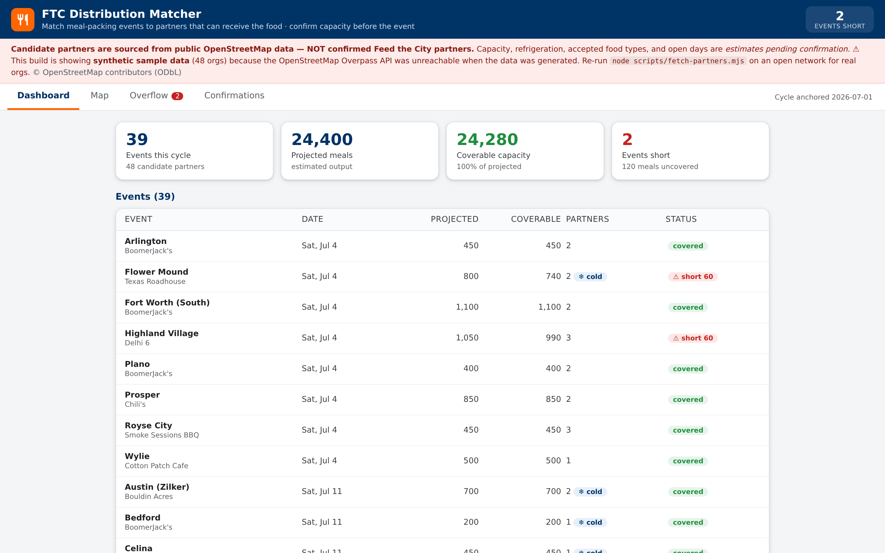
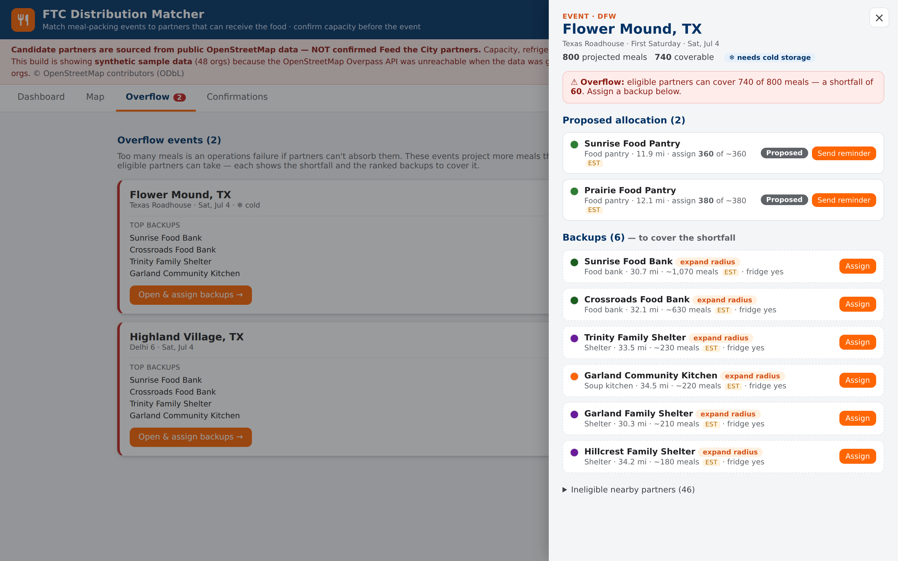
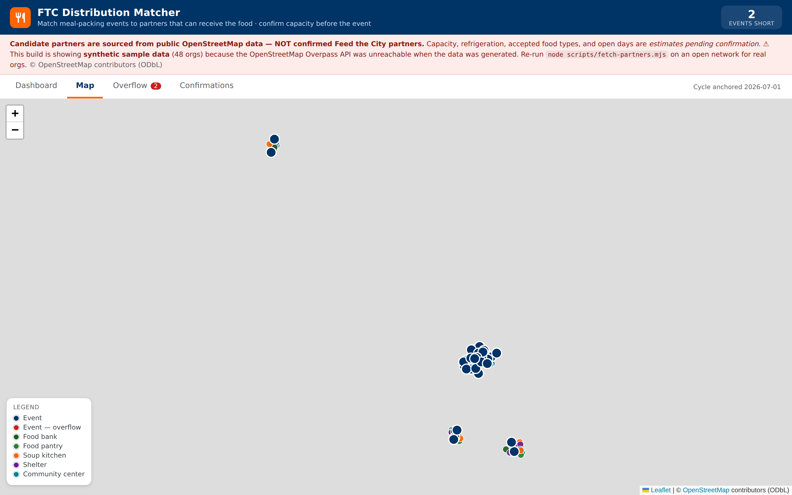

# FTC Distribution Matcher

A public-safe web app that matches each Feed the City meal-packing event to nearby
partner organizations that can actually **receive** its food, confirms capacity before
the event, and surfaces **ranked backups when an event overflows** a partner's capacity
— so volunteer output never turns into wasted food.

> The non-obvious point: **too many meals is an operations failure** if no partner can
> absorb them. This tool makes the shortfall visible early and gives you a ranked way to
> cover it.

It is a public, OpenStreetMap-based companion to the internal
[FTC Distribution Tool](../README.md) in this repo (the Google Sheets + Apps Script back
office). This app invents nothing private: it draws candidate partners from public map
data and labels every estimate as an estimate.

---

## Status — honest

**Working demo on a real matching engine + real public event data.** Built and tested;
all five screens work; the allocation is computed, not hardcoded; the engine is unit
tested.

Two caveats, stated plainly:

1. **Candidate partners are currently SAMPLE data, not live OpenStreetMap.** The build
   environment's network blocks the Overpass API, so `data/partners.json` was written by
   the fetch script's clearly-labeled fallback (`source: "sample-fallback"`, 48 synthetic
   orgs across the four metros). The app banner says so. **Run
   `node scripts/fetch-partners.mjs` from a normal network to replace it with real OSM
   orgs** — the app then renders real data with no code change. See
   [Data provenance](#data-provenance).
2. **Not yet deployed to a public URL from here.** The same network policy blocked the
   deploy upload. A one-step deploy is wired up and ready — see [Deploy](#deploy).

Everything below marked **Planned** is not built yet.

---

## Screenshots

| Cycle dashboard | Event drill-down (overflow → backups) |
|---|---|
|  |  |



*(The map tiles are blank in these captures because the capture sandbox blocks
`tile.openstreetmap.org`; tiles load normally in a real browser. The colored pins are
the real rendered partner/event markers.)*

---

## What it does — the five screens

1. **Dashboard** — the cycle at a glance: event count, total projected meals vs.
   coverable capacity, and how many events are **short**.
2. **Map** — every candidate partner pin (colored by type) and event marker on
   OpenStreetMap tiles (no Google Maps key needed). Click for details.
3. **Event drill-down** — the proposed allocation with status chips, plus ineligible
   nearby partners greyed out **with the reason** (too far / no refrigeration / wrong
   food type).
4. **Overflow** — every event whose projected meals exceed eligible capacity, with the
   shortfall and a **ranked backup list**; assign a backup in one click.
5. **Confirmations** — the pending list with simulated **"send reminder"** and **"mark
   confirmed"** (lifecycle: proposed → reminder sent → confirmed → delivered), saved to
   `localStorage`. No real outreach ever happens.

---

## The matching engine (computed, not hardcoded)

All allocation logic is in **[`src/lib/matching.js`](src/lib/matching.js)**; the tunables
are in **[`../config/matching.json`](../config/matching.json)** so the rules are
auditable. Nothing is hardcoded per event.

- **Hard constraints** (`evaluatePartner`): a partner is eligible for an event only if it
  is within `maxRadiusMiles` (default **25 mi**, Haversine distance), has refrigeration
  *if the event needs it*, and accepts the event's food type (FTC packs shelf-stable
  `packaged` meals).
- **Allocation** (`allocateEvent`): fill `projectedMeals` greedily across eligible
  partners, **closest first** then larger capacity, stopping once filled.
- **Overflow**: if eligible capacity can't cover the meals, the remainder is the
  **shortfall** and the event is flagged.
- **Ranked backups** (`rankBackups`): partners not already assigned, ranked by **free
  capacity → distance → type fit**. In-radius partners rank first; partners that fail
  *only* the radius test (within `backupExpandRadiusFactor`) follow as flagged
  **"expand radius"** candidates, so an overflowing event always has an actionable next
  step.

### Tests

```sh
cd app && npm test
```

[`src/lib/matching.test.js`](src/lib/matching.test.js) covers the two required cases plus
others (9 tests):

- **overflow → ranked backups** — eligible capacity < projected meals ⇒ shortfall flagged,
  closest-first allocation, and the out-of-radius partner surfaced as an expansion backup;
- **refrigeration exclusion** — a fridge-needing event excludes no-fridge partners (and the
  same partner is eligible when the event doesn't need cold storage).

---

## Estimated operational fields (honest by design)

Public directories publish a name, type, and location — **not** meal-acceptance capacity,
refrigeration, accepted food types, or open days. Those four fields are produced by a
documented, deterministic heuristic in
[`../scripts/lib/estimate.mjs`](../scripts/lib/estimate.mjs), seeded by the org's stable id
so values never change between runs:

| Field | How it's estimated |
|---|---|
| `capacityMeals` | per-type base (food bank > pantry > soup kitchen > shelter > community centre) × a stable ±30% jitter |
| `hasRefrigeration` | probability by type (food bank ~0.9 … community centre ~0.3), thresholded by a stable hash |
| `acceptedFoodTypes` | fixed per type (all accept `packaged`) |
| `openDays` | a stable subset of the week |

Every one of these is labeled **`EST` (estimate — confirm)** in the UI. The confirmation
workflow exists precisely to turn an estimate into a confirmed value; the app never
presents an estimate as a real figure.

---

## Data provenance

- **Partners:** OpenStreetMap via the **Overpass API** (`amenity=social_facility` →
  `food_bank`/`soup_kitchen`/`shelter`, `amenity=food_bank`, relevant
  `community_centre`). No API key. © OpenStreetMap contributors, **ODbL**. Cached to
  [`../data/partners.json`](../data/partners.json) so the app never calls Overpass at
  runtime. *(Currently the labeled sample fallback — see [Status](#status--honest).)*
- **Events:** the real FTC public event data in
  [`../reference/events-sample.csv`](../reference/events-sample.csv) (a snapshot of the
  sibling [feed-the-city-event-map](https://github.com/drohat38/feed-the-city-event-map)
  published sheet). 39 events fall within the four configured metros; `projectedMeals`
  and `needsRefrigeration` are deterministic estimates (the event sheet doesn't publish
  them).
- **Regions:** [`../config/regions.json`](../config/regions.json) — Dallas–Fort Worth,
  Austin, Houston, and Denver, derived from the cities in the event data. Add regions to
  expand coverage.

### Refresh the data

```sh
node scripts/fetch-partners.mjs   # real OSM partners → data/partners.json (or labeled fallback)
node scripts/build-events.mjs     # events → data/events.json
```

The fetch script uses a descriptive User-Agent, a timeout, retries with backoff, and a
mirror — respecting Overpass's usage policy (build-time fetch + cache, bounded area).

---

## Public / private boundary

This app is **100% public-safe**. It contains no API keys, no secrets, and no private FTC
data. Candidate partners come from open data and are clearly labeled "NOT confirmed Feed
the City partners." Real partner contacts, agreements, and capacities live only in the
private Google Sheets workbook behind the [internal tool](../README.md) — never here.

---

## Run locally

```sh
cd app
npm install
npm run dev      # → http://localhost:5173
```

Build / preview / test:

```sh
npm run build && npm run preview   # → http://localhost:4173
npm test
```

No environment variables, no API keys. OpenStreetMap tiles need no key.

---

## Deploy

The app is a static Vite build (`app/dist`). This repo is connected to **Cloudflare
Pages** — give this app its **own** Pages project, separate from the one serving the old
`src/` map (so that map keeps working):

1. Cloudflare dashboard ▸ **Workers & Pages ▸ Create ▸ Pages ▸ Connect to Git** ▸ this repo.
2. Build settings: **Framework preset** Vite · **Root directory** `app` · **Build command**
   `npm run build` · **Build output directory** `dist`.
3. Deploy. Every push to the production branch redeploys; preview deploys are built per PR.

Vite's `base: "./"` keeps asset paths relative, so the build works as-is on any
`*.pages.dev` URL or subpath.

*Alternative (zero-config, no Cloudflare):* GitHub Pages via
[`.github/workflows/deploy-app.yml`](../.github/workflows/deploy-app.yml) — enable repo
**Settings ▸ Pages ▸ Source = GitHub Actions** and it publishes to
`https://drohat38.github.io/ftc-distribution-tool/` on push to `main`.

> Heads-up: the build sandbox that generated this couldn't push a deploy itself — its
> network policy blocks outbound upload endpoints (the same reason the OSM data fell back
> to sample). Both paths above build on Cloudflare's / GitHub's own infrastructure and
> work normally.

---

## Project structure

```
app/
├── index.html
├── vite.config.js              # @config + @data aliases to the repo-root folders
├── src/
│   ├── App.jsx                 # tab shell + drill-down drawer
│   ├── data.js                 # loads partners/events/config, computes allocations
│   ├── store.jsx               # assignment-status store (localStorage)
│   ├── format.js               # labels, colors, formatting
│   ├── lib/
│   │   ├── geo.js              # haversine
│   │   ├── matching.js         # THE ENGINE — evaluate / allocate / rankBackups
│   │   └── matching.test.js    # vitest (overflow + refrigeration cases)
│   └── components/             # Banner, Dashboard, MapView, EventDrilldown, Overflow, Confirmations, StatusControl
config/        # regions.json, matching.json  (tunables — auditable)
data/          # partners.json, events.json   (generated, committed)
scripts/       # fetch-partners.mjs, build-events.mjs, lib/{estimate,csv}.mjs
```

---

## AI-assisted development

This app was built with AI assistance (Claude Code) in a single session: data pipeline,
matching engine, tests, React UI, and deploy config. A human should review the matching
rules and confirm any partner before relying on it operationally — the data is public
candidates with **estimated** operational fields, not a verified partner list.

## Planned (not built)

- Replace the sample fallback with live OSM data (run the fetch script on an open network).
- Persist confirmations to a real backend instead of `localStorage`.
- Bridge confirmed matches into the internal Apps Script tool by `EventID`.
- Let an operator tune `maxRadiusMiles` / weights from the UI.
