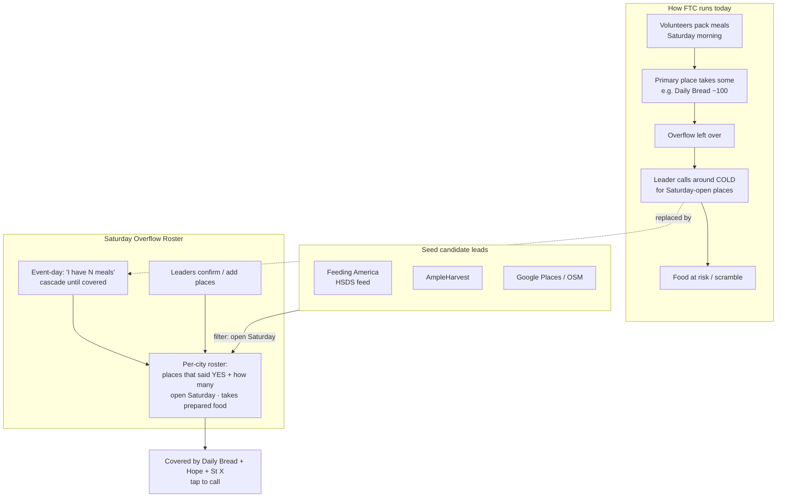

# Concept: the Saturday Overflow Roster

*A focused proposal for a Feed the City leader tool. Prototype: [`src/roster.html`](../src/roster.html) (deploys to the same Cloudflare site as the map, at `…pages.dev/roster.html`).*

---

## 1. How Feed the City runs today

The tool only makes sense against the real operation, so here it is in plain terms:

- **Chapters & leaders.** FTC runs in many cities; each city has a volunteer **leader** (Denton → Deven, etc.).
- **A fixed Saturday cadence.** Each city's event is on a set **Saturday of the month** (First/Second/Third/Fourth), in the **morning** (~8:30–10:30am), hosted at a local **restaurant/venue**.
- **The event makes food.** Volunteers gather and **pack prepared meals**.
- **The hand-off is the hard part.** That food has to go to a local org that will **receive and distribute it that same day**. Usually there's one **primary** place (e.g. *Daily Bread*) — but it has a **capacity limit** ("could only take so many").
- **Overflow = a scramble.** When the event makes more than the primary can take, the leader **calls around** to find other places that are *open Saturday* and *will take prepared food*. That knowledge is hard-won and then **lost** — next month starts from zero.
- **Food safety matters.** Prepared/cooked food must be **served same-day** or **refrigerated & redistributed** (Texas TFER pathway) — so not every pantry is a fit.

**The pain, in one sentence:** *It's Saturday morning, the primary place is full, and the leader has to cold-call for somewhere open that'll take ~N prepared meals — every single month.*

---

## 2. What already exists (so we don't rebuild it)

Real research (key sources linked inline): the **directory** and the **logistics** are already solved by others —

- **[Feeding America HSDS / Open Referral feed](https://feedam.org/hsds)** — a free, national, *structured* directory of food-assistance receiving orgs (the same HSDS standard the PRD chose). This can seed candidate places for every FTC city.
- **[AmpleHarvest](https://ampleharvest.org/find-pantry/)** — pantries by zip, with each one's preferred receiving day/time.
- **[MealConnect](https://mealconnect.org/) / [Careit](https://careit.com/)** — free donor→agency food-rescue platforms; **[Food Rescue Hero](https://foodrescuehero.org/)** — volunteer-driver dispatch.

**So an FTC tool shouldn't be a directory or a logistics app.** Those exist. What none of them do well is the *FTC-specific corner*: **Saturday-open + takes prepared food + confirmed "will take ~N" + your own institutional memory + the overflow cascade.** That gap is the whole product.

---

## 3. The concept

**A per-city "Saturday Overflow Roster" — memory + a coverage plan for the day-of scramble.**

Two moves, both shown in the prototype:

1. **Roster (the memory).** Each city has a list of places, by **trust stage**:
   - **Confirmed** — a leader called and the place *said yes* to prepared food on a Saturday, with **how many meals** it takes. These feed the plan.
   - **Contacted** — reached out, not yet a firm yes.
   - **Lead** — a candidate from public data, not called yet.
   Every confirmation a leader logs makes the roster better for the *next* leader. The roster grows itself.

2. **Coverage plan (the day-of).** The leader picks their city, types **"I have N meals,"** and the tool **cascades** across the confirmed places until N is covered — *Riverside Kitchen 120 + Northgate Pantry 90 + …* — each with a **tap-to-call** button. If it's short, it points at the contacted places / leads to call and confirm.

**Candidates** to add to the roster are **seeded from the public directories above**, filtered to *open Saturday* — so leaders aren't cold-calling random pantries; they're confirming a short, relevant list.

---

## 4. Concept map

---

## 5. How it fits what you already have

- It's **one more page on your existing Cloudflare site** (`roster.html` next to `index.html`) — not a separate app or project.
- The internal Google Sheet + Apps Script tool already does ~70% of the back end: a **Partners** list, **Seed Pantries** (candidate discovery), and a **capacity-confirm** workflow. The roster is the **leader-facing front door** over that, narrowed to the Saturday-overflow job.
- The public map (`index.html`) stays the "where does food go" overview; the roster is the "place today's food" action. They link to each other.

## 6. Privacy

- The **public** layer (browse places, types, Saturday hours) is safe to expose.
- **Contact numbers** sit behind a leader sign-in in the real version (the PRD's "private gated map") — phones are only shown to leaders. The prototype shows them because it's demo data with fictional 555 numbers.

## 7. What it is NOT
- Not a meal-count predictor (forecasting is a known dead end — quantities aren't known until the day).
- Not auto-assignment or routing.
- Not a public listing of real partners' private contacts.

## 8. Feasibility & next steps
- **Prototype:** done — `src/roster.html`, self-contained, deploys with your site. Demo data + browser-local edits.
- **To make it real (needs open network / a small backend):**
  1. Seed candidate leads per city from the Feeding America HSDS feed (+ AmpleHarvest / Google), filtered to Saturday-open.
  2. Store confirmations/capacities in the shared Sheet (or a small backend) instead of `localStorage`, so the roster is shared across leaders.
  3. Add the Google sign-in gate for contacts.
- **Physical (you):** the fastest path to *real* confirmed places is to call your **local food bank** (North Texas Food Bank for DFW) and ask which of their agencies take prepared food on Saturdays — that seeds the "confirmed" column with real data on day one.
